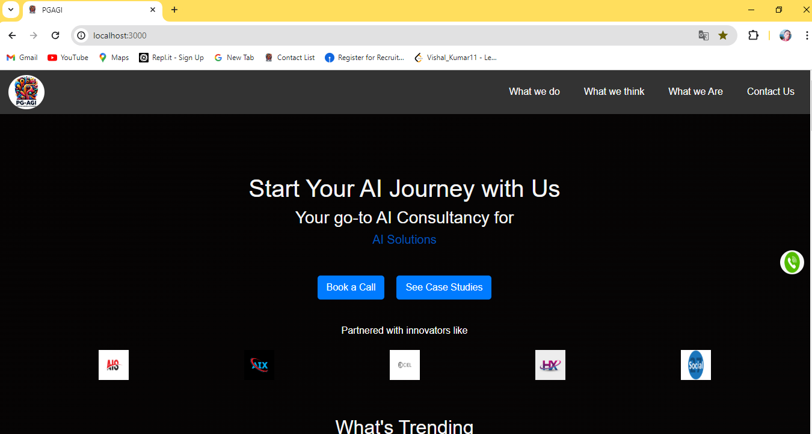
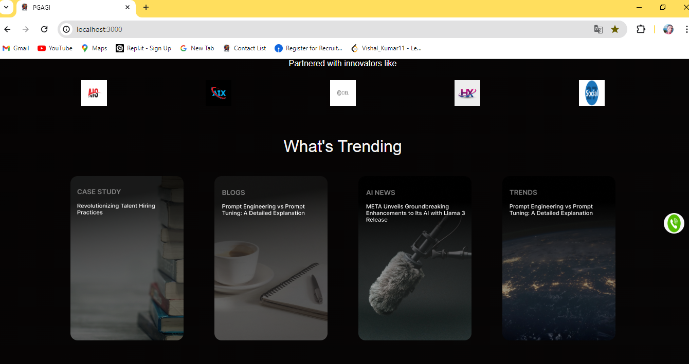
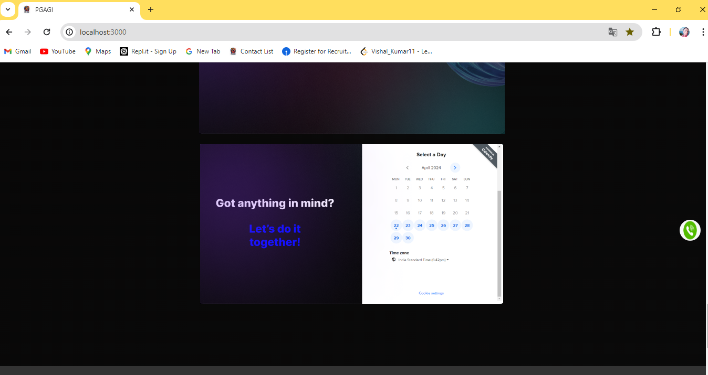
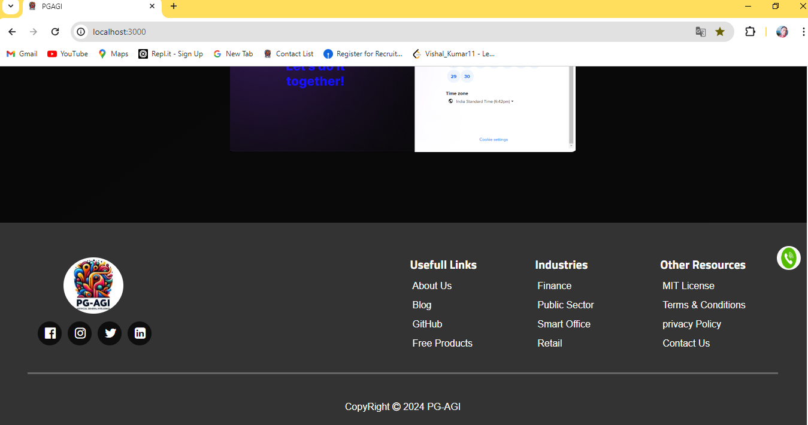

# AI Consultancy Website

<p align="justify"> ✍This project is a React-based web application designed for an AI consultancy firm. It features a comprehensive layout with various sections including a header, main content area, and footer, each styled with modular CSS.</p>

### Click the Go Live button and see the live👉 [Go Live](https://ai-consultancy-website.netlify.app)

## Installation
- Install the required dependencies using npm install.
- Start the server using npm start.

## Project Structure

### Components

This application is structured into three main React components:

1. **Header** - Displays the navigation menu and company logo.
2. **MainContent** - Contains the main sections of the website, showcasing services, partnerships, and trending topics.
3. **Footer** - Provides additional links and company information.

Each component is styled using CSS modules to ensure that styles do not clash across components.

### Styles

CSS modules are used for styling components to encapsulate styles and prevent global namespace pollution.

## FDoldere Structure
- #### public
- #### src
   - ##### compoments
      - ###### Footer.js
      - ###### Header.js
      - ###### MainComponent.js
   - ##### pictures
      - ###### All Pictures
   - ##### styles
      - ###### Footer.module.css
      - ###### Header.module.css
      - ###### MainComponent.module.css
   - ##### App.css
   - ##### App.js
   - ##### index.css
   - ##### index.js
- #### package.json
- #### README.md

### Images

The application utilizes several images to enhance the UI, such as logos, banners, and icons. These images are stored in the `pictures` directory and imported directly into the components where they are used.

## Key Features

- **Responsive Navigation Bar**: Includes dropdown menus and is fully responsive to different devices.
- **Dynamic Content Sections**: Showcases AI services, industries served, and case studies dynamically populated from arrays of data.
- **Interactive Footer**: Contains social media icons, useful links, and other resources.

## Usage

1. **Navigation Menu**: Hover over the menu items to see dropdown choices related to the company's services and industries.
2. **Book a Call and Case Studies**: Interactive buttons to engage users for business inquiries and to display detailed project descriptions.
3. **Social Media Links**: Located in the footer for easy access to social platforms.


```bash
# Clone the repository
git clone https://your-repository-link

# Navigate to the project directory
cd ai-consultancy-website

# Install dependencies
npm install

# Start the development server
npm start
```

## Screenshorts
   - ### Hopme Page
      - 

   - ### Trending Page
      - 

   - ### Calendar Page
      - 

   - ### Footer Page
      - 


# Getting Started with Create React App

This project was bootstrapped with [Create React App](https://github.com/facebook/create-react-app).

## Available Scripts

In the project directory, you can run:

### `npm start`

Runs the app in the development mode.\
Open [http://localhost:3000](http://localhost:3000) to view it in your browser.

The page will reload when you make changes.\
You may also see any lint errors in the console.

### `npm test`

Launches the test runner in the interactive watch mode.\
See the section about [running tests](https://facebook.github.io/create-react-app/docs/running-tests) for more information.

### `npm run build`

Builds the app for production to the `build` folder.\
It correctly bundles React in production mode and optimizes the build for the best performance.

The build is minified and the filenames include the hashes.\
Your app is ready to be deployed!

See the section about [deployment](https://facebook.github.io/create-react-app/docs/deployment) for more information.

### `npm run eject`

**Note: this is a one-way operation. Once you `eject`, you can't go back!**

If you aren't satisfied with the build tool and configuration choices, you can `eject` at any time. This command will remove the single build dependency from your project.

Instead, it will copy all the configuration files and the transitive dependencies (webpack, Babel, ESLint, etc) right into your project so you have full control over them. All of the commands except `eject` will still work, but they will point to the copied scripts so you can tweak them. At this point you're on your own.

You don't have to ever use `eject`. The curated feature set is suitable for small and middle deployments, and you shouldn't feel obligated to use this feature. However we understand that this tool wouldn't be useful if you couldn't customize it when you are ready for it.

## Learn More

You can learn more in the [Create React App documentation](https://facebook.github.io/create-react-app/docs/getting-started).

To learn React, check out the [React documentation](https://reactjs.org/).

### Code Splitting

This section has moved here: [https://facebook.github.io/create-react-app/docs/code-splitting](https://facebook.github.io/create-react-app/docs/code-splitting)

### Analyzing the Bundle Size

This section has moved here: [https://facebook.github.io/create-react-app/docs/analyzing-the-bundle-size](https://facebook.github.io/create-react-app/docs/analyzing-the-bundle-size)

### Making a Progressive Web App

This section has moved here: [https://facebook.github.io/create-react-app/docs/making-a-progressive-web-app](https://facebook.github.io/create-react-app/docs/making-a-progressive-web-app)

### Advanced Configuration

This section has moved here: [https://facebook.github.io/create-react-app/docs/advanced-configuration](https://facebook.github.io/create-react-app/docs/advanced-configuration)

### Deployment

This section has moved here: [https://facebook.github.io/create-react-app/docs/deployment](https://facebook.github.io/create-react-app/docs/deployment)

### `npm run build` fails to minify

This section has moved here: [https://facebook.github.io/create-react-app/docs/troubleshooting#npm-run-build-fails-to-minify](https://facebook.github.io/create-react-app/docs/troubleshooting#npm-run-build-fails-to-minify)


